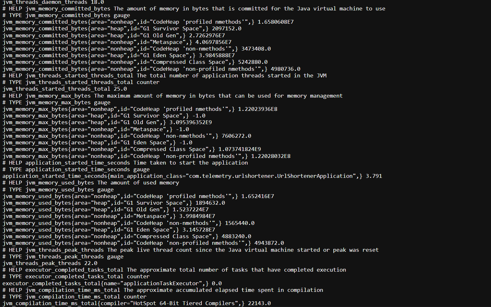
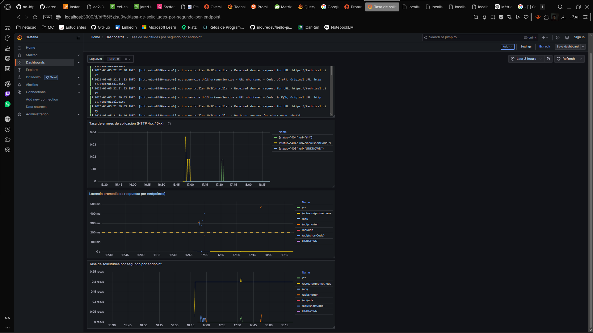
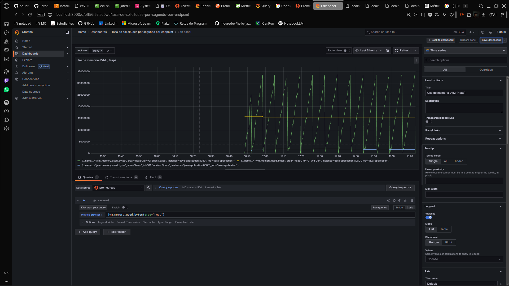
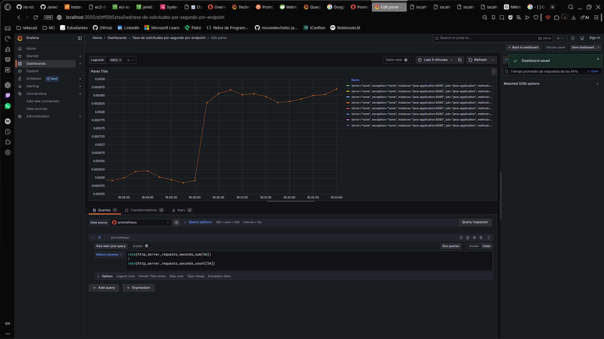

# Bitácora Experimento - Observabilidad y Monitoreo

**Nombre del estudiante:** _Jared Sebastian Farfan Guevara__  
---

Cuando acabes no olvides ayudarnos evaluando tu ⭐[experiencia](https://forms.office.com/r/US1LARPmec)⭐

## Tabla de Contenidos
- [Etapa 1: Preparación del Ambiente](#etapa-1-preparación-del-ambiente)
- [Etapa 2: Métricas Iniciales](#etapa-2-métricas-iniciales)
- [Etapa 2.1: Dashboard Base en Grafana](#etapa-21-dashboard-base-en-grafana)
- [Etapa 2.2: Propuesta de Métrica Personalizada](#etapa-22-propuesta-de-métrica-personalizada)
- [Etapa 3: Experimentación y Análisis del Sistema](#etapa-3-experimentación-y-análisis-del-sistema)

---

## Etapa 1: Preparación del Ambiente


 

### 1.1. Información de la instancia EC2

 

 


### 1.2. Verificación del despliegue


**¿La aplicación se desplegó correctamente?** 

- [x] Sí
- [ ] No

**Captura de pantalla de la aplicación funcionando:**

[> _\[Inserta aquí la imagen de la aplicación corriendo en /api/\]_](http://ec2-3-92-70-195.compute-1.amazonaws.com/api/)

### 1.3. Observaciones y problemas encontrados (opcional)

---

## Etapa 2: Métricas Iniciales



### 2.0.1. Generación de tráfico

**Endpoints probados:**

- [ ] `GET /api/`
- [ ] `POST /api/shorten`
- [ ] `GET /api/{shortCode}`
- [ ] `GET /api/urls`


### 2.0.2. Análisis de dos métricas relevantes

#### Métrica 1

**Nombre de la métrica:**  

http_server_requests_seconds


**Tipo de métrica:** 
- [ ] Counter
- [ ] Gauge 
- [ ] Histogram 
- [x] Summary

**Descripción de qué información aporta:**

Esta métrica mide el tiempo que tardan en procesarse las solicitudes HTTP
recibidas por el servidor. Al ser un Summary, incluye el número total de
peticiones procesadas y la suma total del tiempo de todas ellas.

Permite analizar la latencia de las peticiones hacia los endpoints de la
aplicación, por ejemplo /api/urls, /api/shorten o /actuator/prometheus.
También permite identificar si ciertas rutas o métodos HTTP tienen
tiempos de respuesta más altos que otros.


**Relación con otras métricas (si aplica):**

Un aumento en el tiempo de respuesta de las solicitudes HTTP puede estar
relacionado con un aumento en el uso de CPU (process_cpu_usage), mayor
uso de memoria (jvm_memory_used_bytes) o actividad del recolector de
basura (jvm_gc_pause_seconds).

También puede relacionarse con errores HTTP o saturación de hilos del
servidor.


**¿En que escenarios puede ayudar esta métrica?**

Detectar endpoints lentos o con problemas de rendimiento.

Analizar el comportamiento del sistema bajo carga.

Identificar cuellos de botella en APIs.

Monitorear la latencia promedio de la aplicación.

Evaluar el impacto de cambios en el código o infraestructura.


**¿Qué etiquetas (labels) se utilizan para agrupar los datos?**

method
status
uri
outcome
exception
error


---

#### Métrica 2

**Nombre de la métrica:**  

jvm_memory_used_bytes


**Tipo de métrica:** 
- [ ] Counter
- [x] Gauge 
- [ ] Histogram 
- [ ] Summary

**Descripción de qué información aporta:**

Esta métrica indica la cantidad de memoria actualmente utilizada por la
JVM en bytes. Permite observar cómo se distribuye el uso de memoria entre
las diferentes áreas de memoria del proceso Java, como el heap y el
non-heap.

Incluye componentes como G1 Eden Space, G1 Old Gen, Metaspace y CodeHeap,
lo cual permite identificar qué parte de la JVM está consumiendo más
memoria.


**Relación con otras métricas (si aplica):**

Un aumento en el uso de memoria puede provocar mayor actividad del
recolector de basura, lo cual se puede observar en métricas como
jvm_gc_pause_seconds o jvm_gc_overhead_percent.

También puede correlacionarse con el número de threads activos o con la
carga de solicitudes HTTP en la aplicación.


**¿En que escenarios puede ayudar esta métrica?**

Detectar posibles fugas de memoria.

Analizar el comportamiento de la memoria en producción.

Ajustar el tamaño del heap de la JVM.

Identificar consumo excesivo de Metaspace o del heap.

Monitorear el impacto de nuevas funcionalidades en el uso de memoria.


**¿Qué etiquetas (labels) se utilizan para agrupar los datos?**

area
id

## Etapa 2.1: Dashboard Base en Grafana


### 2.1.1. Evidencia: Dashboard Base en Grafana con los 4 paneles iniciales




### 2.1.2. Visualizaciónes Adicionales (Con las metricas actuales)

#### Visualización Adicional 1

#### Visualización Adicional 1

**Propósito:**

Analizar el consumo de memoria del heap de la JVM para identificar
cómo evoluciona el uso de memoria de la aplicación durante su ejecución
y detectar posibles problemas de consumo excesivo o fugas de memoria.
Se utiliza la métrica jvm_memory_used_bytes.


**Título del panel:**

Uso de memoria JVM (Heap)


**Consulta (PromQL o LogQL):**

jvm_memory_used_bytes{area="heap"}


**Tipo de visualización:** 
- [x] Time series
- [ ] Gauge
- [ ] Bar chart
- [ ] Stat
- [ ] Logs
- [ ] Otro: _____

**Otros ajustes aplicados (colores, unidades, etc.) (opcional):**

Unidad configurada en bytes (data → bytes).
Se utilizaron diferentes colores para distinguir los distintos espacios
de memoria del heap como Eden Space, Survivor Space y Old Gen.


**Captura de pantalla:**



**Análisis (2-3 frases):**

Se observa cómo la memoria del heap se distribuye entre las diferentes
regiones de la JVM. Eden Space suele presentar variaciones frecuentes
debido a la creación de nuevos objetos, mientras que Old Gen crece más
lentamente. Si el uso de Old Gen aumenta constantemente podría indicar
posibles problemas de memoria o necesidad de ajuste del heap.


---

#### Visualización Adicional 2

**Propósito:**

Visualizar el tiempo promedio de respuesta de las solicitudes HTTP
para identificar posibles problemas de latencia en los endpoints de la
aplicación. Se utilizan las métricas http_server_requests_seconds_sum
y http_server_requests_seconds_count para calcular el tiempo promedio.


**Título del panel:**

Tiempo promedio de respuesta de las APIs


**Consulta (PromQL o LogQL):**

rate(http_server_requests_seconds_sum[5m])
/
rate(http_server_requests_seconds_count[5m])


**Tipo de visualización:** 
- [x] Time series
- [ ] Gauge
- [ ] Bar chart
- [ ] Stat
- [ ] Logs
- [ ] Otro: _____

**Otros ajustes aplicados (colores, unidades, etc.) (opcional):**

Unidad configurada en segundos (seconds).
Se aplicó agrupación por endpoint (uri) para observar qué rutas presentan
mayor latencia.


**Captura de pantalla:**



**Análisis (2-3 frases):**

El gráfico permite observar la evolución del tiempo promedio de respuesta
de las solicitudes HTTP. Si se presentan aumentos repentinos en la latencia,
puede indicar problemas de rendimiento en ciertos endpoints o mayor carga
en el servidor. Este tipo de visualización es útil para detectar degradación
del servicio en tiempo real.


---

### 2.1.3. Análisis final del dashboard

**¿Qué otros datos te gustaría visualizar si tuvieras más información disponible?**

Sería útil visualizar métricas relacionadas con el uso de la base de datos,
como el tiempo de ejecución de consultas o el número de conexiones activas.
También sería interesante monitorear métricas de red y throughput de la
aplicación para entender mejor el comportamiento bajo carga.

Adicionalmente, métricas más detalladas sobre el garbage collector,
latencia por endpoint específico y número de usuarios concurrentes
permitirían tener una visión más completa del rendimiento del sistema.

---

## Etapa 2.2: Propuesta de Métrica Personalizada


### 2.2.1. Análisis y propuesta de la métrica propia (en Java)


**1. Nombre de la métrica:**
```
url_shortener_url_access_total
```

**2. Tipo de métrica:**
- [x] Counter
- [ ] Gauge

**3. ¿Qué comportamiento mide?**
```
Cuenta el número total de veces que se accede a una URL corta (shortCode) en el sistema. Cada vez que un usuario utiliza un shortCode para redirigirse a la URL original, la métrica se incrementa.
```

**4. ¿Por qué es relevante para el sistema?**
```
Permite monitorear la popularidad y uso de los enlaces acortados, identificar los más utilizados y detectar posibles abusos o patrones de tráfico. Es útil para analizar el comportamiento de los usuarios y tomar decisiones sobre la gestión de URLs.
```

---


### 2.2.3. Visualización en Grafana


**1. ¿Qué tipo de panel usaste en Grafana?**
- [x] Stat  
- [ ] Time series  
- [ ] Gauge  
- [ ] Bar chart  
- [ ] Otro: _____


**2. ¿Qué consulta PromQL vas a utilizar?**
```promql
url_shortener_url_access_total
```


**3. ¿Cuál es el propósito de la visualización?**
```
El propósito es mostrar el número total de accesos a URLs cortas en el sistema. Permite visualizar el uso acumulado de los enlaces acortados y detectar tendencias de popularidad o posibles abusos. Es útil para monitorear el impacto y la utilidad del servicio de acortamiento de URLs.
```


---

### 2.2.4. Panel creado en Grafana

**Captura de pantalla del panel en Grafana:**

> _[Inserta aquí la imagen del panel mostrando la métrica visualizada]_

---

## Etapa 3: Experimentación y Análisis del Sistema

### 3.1. Detección de anomalías y puntos de interés

**1. Como describirias la anomalía?**

```


```

**2. Que paneles te ayudaron a identificarlo?**

``` 


```

**3. Cual podria ser la causa de la anomalía?**

``` 


```

**Captura de pantalla del dashboard mostrando la anomalía:**

> _[Inserta aquí la imagen]_

---

### 3.2. Intento de corrección de anomalías


#### 3.2.1. Modificación del código

**Descripción del ajuste realizado:**
```
Describe en pocas palabras el ajuste realizado.


```

#### 3.2.2. Resultados después del despliegue

**¿El ajuste surtió efecto?**
- [ ] Sí 
- [ ] No 
- [ ] Parcialmente


**Captura de pantalla del dashboard después del ajuste:**

> _[Inserta aquí la imagen del estado del dashboard posterior al ajuste]_

---

### 5.7. Reflexión final

**¿Qué panel te resultó más útil para detectar problemas?**
```


```

**¿Qué métrica aporta mayor valor para monitorear un sistema real?**
```


```

**¿Qué agregarías o mejorarías en tu dashboard?**
```


```

**Fin de la bitácora**
